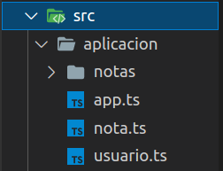
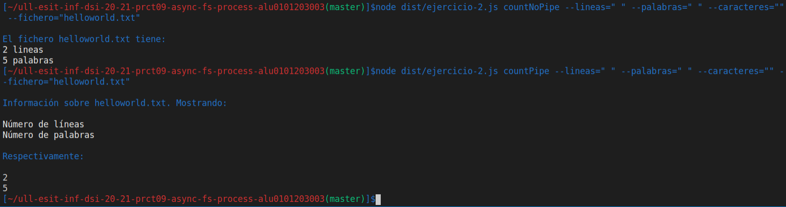
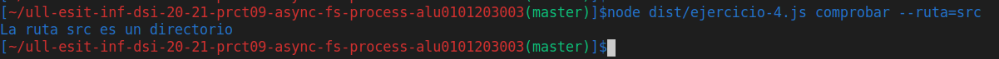
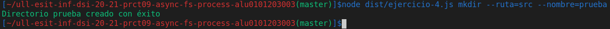
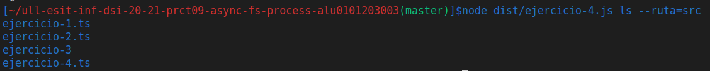
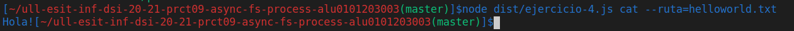
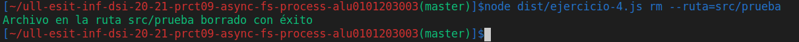
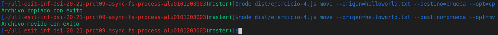

# Práctica 9: Sistema de ficheros y creación de procesos en Node.js. Informe.
## Desarrollo de Sistemas Informáticos 
## Raúl Martín Rigor - alu0101203003@ull.edu.es

### Introducción

En este informe se resumen las actividades realizadas en la **práctica 9** para poner en práctica nuestros conocimientos de TypeScript sobre Node.js para trabajar en la manipulación de ficheros, controlar eventos, manejar procesos... a través de la implementación de distintas funciones en unos ejercicios. En esta práctica tambien haremos uso de los principios SOLID en la medida de lo posible.

### Objetivos

Al finalizar la práctica, habremos completado los siguientes objetivos:

* Crear y manipular con soltura ficheros con Node.js
* Usar correctamente los manejadores para controlar eventos
* Redirigir la salida de un proceso hijo a el proceso padre con el uso de pipe
* Crear aplicaciones funcionales que manejen la entrada de comandos

### 1. Creación y configuración del driectorio del proyecto.

#### 1.1. Estructura inicial

Para la creación de la estructura inicial, seguiremos los mismos pasos que en practicas anteriores ([práctica 4](https://github.com/ULL-ESIT-INF-DSI-2021/ull-esit-inf-dsi-20-21-prct04-arrays-tuples-enums-alu0101203003/blob/gh-pages/index.md)).

La estructura debería quedar similar a las siguientes fotos:

  

#### 1.2. Organización de los ejercicios

Será necesario implementar los ejercicios en ficheros diferentes. Los ficheros que dependan de otros (o de otros paquetes) requeriran de un `import` del recurso que necesiten:

 

#### 1.3. Testing y cubrimiento de código

Se usarán distintas herramientas (a través de GitHub Actions) para tener constancia de los resultados de las pruebas y del cubrimiento de código. Serán instaladas con la ayuda de sus respectivos tutoriales ([Tests de Node.js](https://drive.google.com/file/d/1hwtPovQlGvthaE7e7yYshC4v8rOtLSw0/view), [Coveralls](https://drive.google.com/file/d/1hwtPovQlGvthaE7e7yYshC4v8rOtLSw0/viewhttps://drive.google.com/file/d/1yOonmpVbOyvzx3ZbXMQTAPxvA3a7AE7w/view) y [SonarCloud](https://drive.google.com/file/d/1FLPargdPBX6JaJ_85jNsRzxe34sMi-Z3/view)).

Cabe destacar que en esta práctica no tendrá mucho sentido el cubrimiento de código ni las pruebas ya que trabajamos con ficheros y probar las funciones daría muchos problemas.

### 2. Ejercicios

Paso a explicar la resolución de cada ejercicio y a adjuntar su código. Se mostrará una versión simplificada del enunciado de los ejercicios (para verlos al completo con aclaraciones y pistas, consultar la [guía de la práctica](https://ull-esit-inf-dsi-2021.github.io/prct09-async-fs-process/).

Para poder resolver este ejercicio nos serán de utilidad ciertas herramientas de los paquetes [yargs](https://www.npmjs.com/package/yargs) y [chalk](https://www.npmjs.com/package/chalk), los cuales debemos instalar con sus correspondientes dependencias para el manejo de comandos y el color del texto. También será de vital importancia instalar el paquete `@types/node` para utilizar las APIs de [Node.js](https://nodejs.org/en/).

Todos los manejadores de comandos, métodos auxiliares... se pueden comprobar en el [código fuente de la práctica](https://github.com/ULL-ESIT-INF-DSI-2021/ull-esit-inf-dsi-20-21-prct09-async-fs-process-alu0101203003/tree/master/src) con el fin de no saturar este informe.

#### 2.1 Ejercicio 1

**Enunciado:**

Realice una traza de ejecución de este programa mostrando, paso a paso, el contenido de la pila de llamadas, el registro de eventos de la API y la cola de manejadores de Node.js, además de lo que se muestra por la consola. Para ello, simule que se llevan a cabo, como mínimo, dos modificaciones del fichero helloworld.txt a lo largo de la ejecución del programa anterior. ¿Qué hace la función access? ¿Para qué sirve el objeto constants?

**Resolución:**

El ejercicio fue estudiado y ejecutado para comprender su funcionamiento. A esto ayudaron recursos como el [proporcionado](https://dev.to/lydiahallie/javascript-visualized-event-loop-3dif) en el guión de la práctica así como un [video de youtube](https://www.youtube.com/watch?v=pt2oW_B4FkU) donde se explican la pila, registro de eventos y cola de manejadores.

La traza completa se encuentra en el [código fuente del ejercicio 1](https://github.com/ULL-ESIT-INF-DSI-2021/ull-esit-inf-dsi-20-21-prct09-async-fs-process-alu0101203003/blob/master/src/ejercicio-1.ts)

#### 2.2 Ejercicio 2

**Enunciado:**

Escriba una aplicación que proporcione información sobre el número de líneas, palabras o caracteres que contiene un fichero de texto. La ruta donde se encuentra el fichero debe ser un parámetro pasado a la aplicación desde la línea de comandos. Adicionalmente, también deberá indicarle al programa desde la línea de comandos si desea visualizar el número de líneas, palabras, caracteres o combinaciones de ellas. Puede gestionar el paso de parámetros desde la línea de comandos haciendo uso de yargs.

Lleve a cabo el ejercicio anterior de dos maneras diferentes:

* Haciendo uso del método pipe de un Stream para poder redirigir la salida de un comando hacia otro.
* Sin hacer uso del método pipe, solamente creando los subprocesos necesarios y registrando manejadores a aquellos eventos necesarios para implementar la funcionalidad solicitada.

Para lo anterior, se recomienda leer la documentación de Stream. Piense que la propiedad stdin de un objeto ChildProcess es un Stream de escritura, mientras que su propiedad stdout es un Stream de lectura.

**Resolución:**

Primero se desarrolla la función que no hace uso de pipe ya que es más familiar a la hora de implementarla. Hace uso de *spawn* que invoca al comando `wc` para contar lineas, palabras y caracteres. Esta información se almacena y se formatea para mostrar la salida de la manera que deseemos y en función de la combinación de parámetros solicitada:

```ts
/**
 * Funcion countSinPipe (No hace uso de pipe).
 * Permite mostrar las líneas, palabras y caracteres que contiene un fichero.
 * Cuando alguno de los parametros sea indicado como vacío ("") por comando, se entederá que el usuario
 * no tiene interés en esa información en concreto (de lo contrario será necesario rellenar ese parámetro
 * con cualquier valor como "si", "mostrar" o simplemente " ").
 * @param lineas del fichero
 * @param palabras del fichero
 * @param caracteres del fichero
 * @param fichero (ruta) del fichero sobre el que se aplica el comando
 */
function countSinPipe (lineas :string, palabras :string, caracteres :string, fichero :string) {
  if (!existeFichero(fichero)){
    console.log(chalk.red("Error. El fichero no existe en la ruta indicada"));
  } else {
    const wc = spawn('wc', [`${fichero}`]);

    let wcOutput = '';
    wc.stdout.on('data', (piece) => wcOutput += piece);
      
    wc.on('close', () => {
      const wcOutputAsArray = wcOutput.split(/\s+/);
      console.log(`\nEl fichero ${fichero} tiene: `);
      if (lineas != ""){
        console.log(chalk.white(`${wcOutputAsArray[0]} lineas`));
      }
      if (palabras != ""){
        console.log(chalk.white(`${wcOutputAsArray[1]} palabras`));
      }
      if (caracteres != ""){
        console.log(chalk.white(`${wcOutputAsArray[2]} caracteres`));
      }
    });
  }
  
}
```

Para el otro caso, se desarrollará con pipe. Se hace uso de distintas opciones del comando wc que mostrarán, en cada caso, la información que queremos obtener del archivo. Esta información será redirigida con pipe desde estos procesos hijos (*child proccess*) a el proceso padre para que sea mostrado por pantalla sustituyendo a los *console.log()* implementados en la función anterior:

```ts
/**
 * Funcion countPipe (Hace uso de pipe).
 * Permite mostrar las líneas, palabras y caracteres que contiene un fichero.
 * Cuando alguno de los parametros sea indicado como vacío ("") por comando, se entederá que el usuario
 * no tiene interés en esa información en concreto (de lo contrario será necesario rellenar ese parámetro
 * con cualquier valor como "si", "mostrar" o simplemente " ").
 * @param lineas del fichero
 * @param palabras del fichero
 * @param caracteres del fichero
 * @param fichero (ruta) del fichero sobre el que se aplica el comando
 */
 function countPipe (lineas :string, palabras :string, caracteres :string, fichero :string) {
  if (!existeFichero(fichero)){
    console.log(chalk.red("Error. El fichero no existe en la ruta indicada"));
  } else {
    const wc = spawn('wc', [`${fichero}`]);
    
    console.log(chalk.blue(`\nInformación sobre ${fichero}. Mostrando: \n`))
    wc.on('close', () => {
      if (lineas != ""){
        console.log(chalk.white(`Número de líneas`))
        var childLineas = spawn('sh', [`-c`,`wc -l < ${fichero}`]);
        childLineas.stdout.pipe(process.stdout)
      } 
      if (palabras != ""){
        console.log(chalk.white(`Número de palabras`))
        var childPalabras = spawn('sh', [`-c`,`wc -w < ${fichero}`]);
        childPalabras.stdout.pipe(process.stdout)
      }
      if (caracteres != ""){
        console.log(chalk.white(`Número de caracteres`))
        var childCaracteres = spawn('sh', [`-c`,`wc -c < ${fichero}`]);
        childCaracteres.stdout.pipe(process.stdout)
      }
      console.log(chalk.blue(`\nRespectivamente: \n`))
    });
  }
  
}
```

Estos métodos serán llamados con sus respectivos comandos mostrando la siguiente salida:



#### 2.3 Ejercicio 3

**Enunciado:**

A partir de la aplicación de procesamiento de notas desarrollada en la Práctica 8, desarrolle una aplicación que reciba desde la línea de comandos el nombre de un usuario de la aplicación de notas, así como la ruta donde se almacenan las notas de dicho usuario. Puede gestionar el paso de parámetros desde la línea de comandos haciendo uso de yargs. La aplicación a desarrollar deberá controlar los cambios realizados sobre todo el directorio especificado al mismo tiempo que dicho usuario interactúa con la aplicación de procesamiento de notas. Nótese que no hace falta modificar absolutamente nada en la aplicación de procesamiento de notas. Es una aplicación que se va a utilizar para provocar cambios en el sistema de ficheros.

Para ello, utilice la función watch y no la función watchFile, dado que esta última es más ineficiente que la primera. La función watch devuelve un objeto Watcher, que también es un objeto EventEmitter. ¿Qué evento emite el objeto Watcher cuando se crea un nuevo fichero en el directorio observado? ¿Y cuando se elimina un fichero existente? ¿Y cuando se modifica?

Con cada cambio detectado en el directorio observado, el programa deberá indicar si se ha añadido, modificado o borrado una nota, además de indicar el nombre concreto del fichero creado, modificado o eliminado para alojar dicha nota.

**Resolución:**

En esta ocasión se ha aprovechado la función watch que permite detectar los cambios realizados sobre el directorio. Nos serviremos principalmente de *event* y *trigger* que nos indicarán el evento que se ha activado y el fichero que lo ha activado (respectivamente), cosa que usaremos para realizar distintas acciones en cada caso.

Manejaremos dos tipos de situaciones en funcios de los eventos disponibles:

Cuando se da el evento *change*, sabremos que se ha modificado el contenido de un fichero.

Cuando se da el evento *rename*, puede ser por las siguientes situaciones:
* Se ha eliminado una nota
* Se ha añadido una nota

Para saber de cual de las dos se trata, comprobaremos si existe una ruta con la nota que acaba de disparar el evento para saber si la nota está o no en el directorio y así saber si se acaba de añadir o borrar.

```ts
/**
 * Funcion watchNotas.
 * Indica los cambios realizados sobre el directorio de notas de un usuario
 * @param nombre del usuario
 * @param directorio donde se almacenan las notas
 */
function watchNotas (nombre :string, directorio :string) {
    if (!existeDirectorio(directorio,nombre)){
      console.log(chalk.red("Error. El fichero no existe en la ruta indicada"));
    } else {
        var dir = `${directorio}/${nombre}`
        fs.watch(dir, (event, trigger) => {
            if (event == "change"){
                console.log(chalk.white(`Se ha modificado el contenido de la nota ${trigger}`))
            }
            if (event == "rename"){
                if (existeDirectorio(dir,trigger)){
                    console.log(chalk.white(`Se ha añadido la nota ${trigger}`));
                } else {
                    console.log(chalk.white(`Se ha eliminado la nota ${trigger}`));
                }
            }
        });
      
    }
    
}
```
Este método será llamado con su respectivo comando mostrando la siguiente salida:


#### 2.4 Ejercicio 4

**Enunciado:**

Desarrolle una aplicación que permita hacer de wrapper de los distintos comandos empleados en Linux para el manejo de ficheros y directorios. En concreto, la aplicación deberá permitir:

* Dada una ruta concreta, mostrar si es un directorio o un fichero.
* Crear un nuevo directorio a partir de una nueva ruta que recibe como parámetro.
* Listar los ficheros dentro de un directorio.
* Mostrar el contenido de un fichero (similar a ejecutar el comando cat).
* Borrar ficheros y directorios.
* Mover y copiar ficheros y/o directorios de una ruta a otra. Para este caso, la aplicación recibirá una ruta origen y una ruta destino. En caso de que la ruta origen represente un directorio, se debe copiar dicho directorio y todo su contenido a la ruta destino.


**Resolución:**

En este ejercicio se requerirá de funciones que se pueden realizar fácilmente con comandos literales de bash (de ahí que la aplicación actue a modo de wrapper de Linux). Como habrá que concatenar comandos y hacer comparaciones, se hará uso continuado de la siguiente secuencia (variante del comando spawn):

```ts
child = spawn(`comando1 && comando2`, {
            shell: true
        });
```

Esto nos permitirá hacer comparaciones y actuar en consecuencia entre otras muchas posibilidades como veremos a continuación en cada función.

En el primer comando evaluaremos con el comando `-d` para evaluar si la ruta se trata de un directorio y mostraremos la información con un `echo` indicando si efectivamente se trata de un directorio o, de lo contrario, se trata de un fichero:

```ts
/**
 * Funcion comprobarRuta.
 * Permite mostrar si una ruta es un directorio o un fichero.
 * @param ruta a evaluar
 */
 function comprobarRuta (ruta :string) {
    if (!existeRuta(ruta)){
      console.log(chalk.red("Error. No existe la ruta indicada"));
    } else {
        var childCheck = spawn(`[ -d "${ruta}" ] && echo "La ruta ${ruta} es un directorio" || echo "La ruta ${ruta} es un fichero"`, {
            shell: true
        });
        
        childCheck.stdout.pipe(process.stdout)
    }    
  }
```

Este método será llamado con su respectivo comando mostrando la siguiente salida:



El siguiente comando no requerirá de una llamada a un comando de bash. Para crear un directorio es preferible usar la funcion mkdir que ya conocemos de node.js fs:

```ts
/**
 * Funcion crearDirectorio.
 * Permite crear un nuevo directorio en la ruta indicada.
 * @param ruta destino
 * @param nombreDir nombre del directorio
 */
 function crearDirectorio (ruta :string, nombreDir :string) {
    if (!existeRuta(ruta)){
        console.log(chalk.red("Error. La ruta especificada no existe"));
    }
    if (existeDirectorio(ruta, nombreDir)){
      console.log(chalk.red("Error. Ya existe un directorio con ese nombre en esa ruta"));
    } else {
        fs.mkdir(`${ruta}/${nombreDir}`,() => {
            console.log(chalk.green(`Directorio ${nombreDir} creado con éxito`));
        });
    }  
  }
```

Este método será llamado con su respectivo comando mostrando la siguiente salida:



Para mostrar los ficheros de un directorio haremos uso del comando *ls*

```ts
/**
 * Funcion mostrarFicheros.
 * Permite mostrar los ficheros del directorio en la ruta indicada.
 * @param ruta del directorio
 */
 function mostrarFicheros (directorio :string) {
    if (!existeRuta(directorio)){
        console.log(chalk.red("Error. La ruta especificada no existe"));
    } else {
        var childLs = spawn('sh', [`-c`,`ls ${directorio}`]);
        
        childLs.stdout.pipe(process.stdout)
    }  
  }
```

Este método será llamado con su respectivo comando mostrando la siguiente salida:



El comando *cat* nos permitirá ver el contenido de un fichero

```ts
/**
 * Funcion mostrarContenido.
 * Permite el contenido de un fichero.
 * @param ruta del directorio
 */
 function mostrarContenido (fichero :string) {
    if (!existeRuta(fichero)){
        console.log(chalk.red("Error. El fichero especificado no existe"));
    } else {
        var childCat = spawn('cat', [`${fichero}`]);
        
        childCat.stdout.pipe(process.stdout)
    }
  }
```

Este método será llamado con su respectivo comando mostrando la siguiente salida:




Para borrar cualquier archivo obtenido por comandos usaremos la opción recursiva de `rm` (para cuando se trate de un directorio):

```ts
/**
 * Funcion borrarArchivos.
 * Permite borrar ficheros y directorios
 * @param ruta archivo
 */
 function borrarArchivos (ruta :string) {
    if (!existeRuta(ruta)){
        console.log(chalk.red("Error. La ruta especificada no existe"));
    } else {
        var childRm = spawn('sh', [`-c`,`rm -rf ${ruta}`]);
        
        childRm.on('close', () => {
            console.log(chalk.green(`Archivo en la ruta ${ruta} borrado con éxito`));
        });
    }  
  }
```

Este método será llamado con su respectivo comando mostrando la siguiente salida:




Con el comando `mv` podremos mover cualquier archivo a la ruta que especifiquemos. También está implementada la opción con el comando `cp` que copia el archivo sin eliminarlo de su ruta original. Sin embargo, para que `cp` funcione en directorios será necesario usar la opción `cp -r`. Se evaluará esta situación y se actuará en consecuencia:

```ts
/**
 * Funcion moverArchivos.
 * Permite mover o copiar ficheros y directorios,
 * @param rutaOrigen archivo a mover
 * @param rutaDestino ruta a donde se quiere mover
 */
 function moverArchivos (rutaOrigen :string, rutaDestino :string, opt :string) {
    if (!existeRuta(rutaOrigen)){
      console.log(chalk.red("Error. La ruta especificada no existe"));
    }
    if (!existeRuta(rutaOrigen)){
        console.log(chalk.red("Error. La ruta especificada no existe"));
    } else {
      if (opt == "cp"){
        // Manejar la opción de que sea un directorio
        var childCp = spawn(`[ -d "${rutaOrigen}" ] && cp ${rutaOrigen} ${rutaDestino} || cp -r ${rutaOrigen} ${rutaDestino}`, {
          shell: true
        });
        
        childCp.on('close', () => {
            console.log(chalk.green(`Archivo copiado con éxito`));
        });
      }
      if (opt == "mv"){
        var childMv = spawn('sh', [`-c`,`mv ${rutaOrigen} ${rutaDestino}`]);
        
        childMv.on('close', () => {
            console.log(chalk.green(`Archivo movido con éxito`));
        });
      }
    }  
  }

```

Este método será llamado con su respectivo comando mostrando la siguiente salida:



### Conclusiones

Con esta práctica he aprendido a manejar mejor la herramienta de trabajo (Node.js) para manipular ficheros. Me han sorprendido también las numerosas posibilidades del comando spawn (que usé con mucha frecuencia). Estas herramientas serán muy útiles para cualquiera de mis actuales y siguientes desarrollos.

### Bibliografía

A continuación se muestra una serie de recursos que han sido de gran utilidad para la realización de la práctica y de este informe:

Recurso| Dirección
-------|----------
Guía de la práctica | https://ull-esit-inf-dsi-2021.github.io/prct09-async-fs-process/
Apuntes | https://ull-esit-inf-dsi-2021.github.io/nodejs-theory/nodejs-filesystem.html
Eventos y triggers | https://bhung6494.wordpress.com/2018/09/13/understanding-fs-watch-and-fs-watchfile-in-node-js/
Funciones node.js fs | https://nodejs.org/api/fs.html
Comandos encadenados con spawn | https://stackoverflow.com/questions/35004492/node-child-process-spawn-multiple-commands

