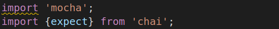

# Práctica 9: Sistema de ficheros y creación de procesos en Node.js. Informe.
## Desarrollo de Sistemas Informáticos 
## Raúl Martín Rigor - alu0101203003@ull.edu.es

### Introducción

En este informe se resumen las actividades realizadas en la **práctica 9** para poner en práctica nuestros conocimientos de TypeScript sobre Node.js para trabajar en la manipulación de ficheros, controlar eventos, manejar procesos... a través de la implementación de distintas funciones en unos ejercicios. En esta práctica tambien haremos uso de los principios SOLID en la medida de lo posible.

### Objetivos

Al finalizar la práctica, habremos completado los siguientes objetivos:

* Crear y manipular con soltura ficheros con Node.js
* Usar correctamente los manejadores para controlar eventos
* Redirigir la salida de un proceso hijo a el proceso padre con el uso de pipe
* Crear aplicaciones funcionales que manejen la entrada de comandos

### 1. Creación y configuración del driectorio del proyecto.

#### 1.1. Estructura inicial

Para la creación de la estructura inicial, seguiremos los mismos pasos que en practicas anteriores ([práctica 4](https://github.com/ULL-ESIT-INF-DSI-2021/ull-esit-inf-dsi-20-21-prct04-arrays-tuples-enums-alu0101203003/blob/gh-pages/index.md)).

La estructura debería quedar similar a las siguientes fotos:

  

#### 1.2. Organización de los ejercicios

Será necesario implementar los ejercicios en ficheros diferentes. Los ficheros que dependan de otros (o de otros paquetes) requeriran de un `import` del recurso que necesiten:

 

#### 1.3. Testing y cubrimiento de código

Se usarán distintas herramientas (a través de GitHub Actions) para tener constancia de los resultados de las pruebas y del cubrimiento de código. Serán instaladas con la ayuda de sus respectivos tutoriales ([Tests de Node.js](https://drive.google.com/file/d/1hwtPovQlGvthaE7e7yYshC4v8rOtLSw0/view), [Coveralls](https://drive.google.com/file/d/1hwtPovQlGvthaE7e7yYshC4v8rOtLSw0/viewhttps://drive.google.com/file/d/1yOonmpVbOyvzx3ZbXMQTAPxvA3a7AE7w/view) y [SonarCloud](https://drive.google.com/file/d/1FLPargdPBX6JaJ_85jNsRzxe34sMi-Z3/view)).

Cabe destacar que en esta práctica no tendrá mucho sentido el cubrimiento de código ni las pruebas ya que trabajamos con ficheros y probar las funciones daría muchos problemas.

### 2. Ejercicios

Paso a explicar la resolución del ejercicio y a adjuntar su código y expectativa. Se mostrará una versión simplificada del enunciado de los ejercicios (para verlos al completo con aclaraciones y pistas, consultar la [guía de la práctica](https://ull-esit-inf-dsi-2021.github.io/prct09-async-fs-process/).

Para poder resolver este ejercicio nos serán de utilidad ciertas herramientas de los paquetes [yargs](https://www.npmjs.com/package/yargs) y [chalk](https://www.npmjs.com/package/chalk), los cuales debemos instalar con sus correspondientes dependencias para el manejo de comandos y el color del texto. También será de vital importancia instalar el paquete `@types/node` para utilizar las APIs de [Node.js](https://nodejs.org/en/).

#### 2.1 Ejercicio 1

**Enunciado:**

**Resolución:**


```ts
```


#### 2.2 Ejercicio 2

**Enunciado:**

**Resolución:**


```ts
```


#### 2.3 Ejercicio 3

**Enunciado:**

**Resolución:**


```ts
```

#### 2.4 Ejercicio 4

**Enunciado:**

**Resolución:**


```ts
```

### Conclusiones

Con esta práctica he aprendido a manejar mejor la herramienta de trabajo (Node.js) para manipular ficheros. Me han sorprendido también las numerosas posibilidades del comando spawn (que usé con mucha frecuencia). Estas herramientas serán muy útiles para cualquiera de mis actuales y siguientes desarrollos.

### Bibliografía

A continuación se muestra una serie de recursos que han sido de gran utilidad para la realización de la práctica y de este informe:

Recurso| Dirección
-------|----------
Guía de la práctica | https://ull-esit-inf-dsi-2021.github.io/prct09-async-fs-process/
Apuntes | https://ull-esit-inf-dsi-2021.github.io/nodejs-theory/nodejs-filesystem.html
Eventos y triggers | https://bhung6494.wordpress.com/2018/09/13/understanding-fs-watch-and-fs-watchfile-in-node-js/
Funciones node.js fs | https://nodejs.org/api/fs.html
Comandos encadenados con spawn | https://stackoverflow.com/questions/35004492/node-child-process-spawn-multiple-commands

